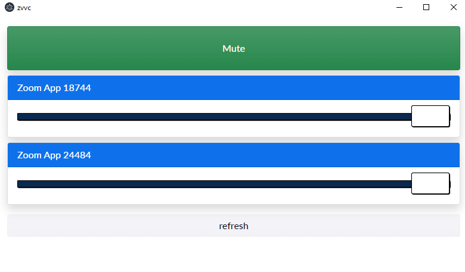

# zvvc - zoom virtual volume control



# Getting Started

These instructions will get you a copy of the project up and running on your local machine. 

Grab the latest executable from [releases](https://github.com/Will4950/zvvc/releases)

# Building locally

**Prerequisites:**
* [Node.js 14](https://nodejs.org/)
* [git](https://git-scm.com/downloads)
* Windows 10

# Setup app locally

Assuming Windows 10.

Clone and install the app and it's dependencies.

```bash
git clone https://github.com/will4950/zvvc
cd zvvc 
npm install 
npm start
```

# Change the microphone

Run zvvc at least 1 time and close the application.  Open `%APPDATA%\zvvc\config.json` in a text editor.

```json
{"microphone":"YOUR DEVICE"}
```
Replace `YOUR DEVICE` with your microphone device name.  Save the file.

# Support

None :)  Please ping me with any discussion!